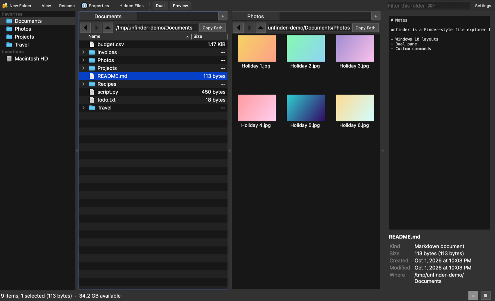

<p align="center">
  
</p>

<h1 align="center">unfinder</h1>

<p align="center">
  A fast, Finder-style file explorer for macOS with Windows&nbsp;10 layouts, dual panes,
  tabs and custom right-click commands. Written in Python with Qt (PySide6).
</p>



## Features

- **Eight Windows 10 layouts.** Extra large, Large, Medium and Small icons, List, Details,
  Tiles and Content. Switch with the **View** button, ⌘1–⌘8, or ⌘ + scroll. Each folder
  remembers its own layout, and image files show thumbnails.
- **Tabs and dual pane.** ⌘T opens a tab; ⌥⌘D splits the window. Tab switches panes, and
  F5 / F6 copy / move to the other pane.
- **Navigation.** Back, Forward and Up buttons and an editable path bar above each pane.
  Type or paste any path, including `~`, quoted paths and `file://` links.
- **Copy paths.** Copy Path button per pane, plus right-click → Copy Path / Copy Name /
  Copy Path of This Folder. Pressing ⌘V on a copied path goes there.
- **File operations.** New folder, rename (F2 or Return), batch rename to "Name (1)",
  "Name (2)", …, duplicate, cut/copy/paste (works with Finder's clipboard), Move to
  Trash, and drag and drop. Large copies run in the background.
- **Properties window** (⌘I). Size and contents counted in the background, dates,
  Read-only / Hidden, and a Permissions tab.
- **Preview panel.** Shows images, text and code, plus Quick Look thumbnails for PDFs and
  videos. Space opens Quick Look.
- **Custom right-click commands.** *Open with VS Code* (`code .`) is included, and you can
  add your own (see below).
- **Sidebar.** Favorites, Macintosh HD, iCloud Drive and external drives.
- **Search and hidden files.** ⌘F filters the current folder as you type, and the
  **Hidden Files** toggle shows dotfiles.
- **Settings** (⌘,). Startup folder, default layout and more. Everything is saved
  automatically.

## Install

Requirements: macOS 12 or later, and [uv](https://docs.astral.sh/uv/)
(`brew install uv`). uv downloads Python, Qt and PyInstaller for you.

```bash
git clone https://github.com/<your-username>/unfinder.git
cd unfinder
./build.sh --install
```

This builds `dist/unfinder.app` and copies it to `/Applications`. Run `./build.sh` without
`--install` to only build it.

## Run from source

```bash
uv run unfinder.py            # opens your home folder (or last session's tabs)
uv run unfinder.py ~/Projects # opens a specific folder
```

## Custom commands

Right-click → **Edit Custom Commands…** (also in the **Commands** menu and Settings).
Commands run in the folder you're viewing, through your login shell. They also find tools in
`~/.local/bin` and Homebrew when the app is opened from the Dock.

| Placeholder | Becomes |
|---|---|
| `{folder}` | the current folder |
| `{file}` | the first selected item (or the folder if nothing is selected) |
| `{files}` | all selected items |
| `{name}` | the item's name |

Examples: `code .` · `code {files}` · `zip -r archive.zip {files}` · `git status`
(tick **Run in Terminal** to see the output).

## Keyboard shortcuts

| Action | Shortcut |
|---|---|
| Layouts (Extra large … Content) | ⌘1 – ⌘8, or ⌘ + scroll |
| Back / Forward / Enclosing folder | ⌘[ / ⌘] / ⌘↑ |
| Open | ⌘O or ⌘↓ |
| Go to path | ⌘L or ⇧⌘G |
| New tab / Close tab / Next tab | ⌘T / ⌘W / ⌃Tab |
| Dual pane / Switch pane | ⌥⌘D / Tab |
| Copy / Move to other pane | F5 / F6 |
| New folder | ⇧⌘N |
| Rename | F2 or Return |
| Duplicate | ⌘D |
| Move to Trash / Delete immediately | ⌘⌫ / ⌥⌘⌫ |
| Copy Path / Copy Name | ⌥⌘C / ⇧⌥⌘C |
| Properties | ⌘I or ⌥Return |
| Quick Look | Space |
| Filter this folder | ⌘F |
| Show hidden files | ⇧⌘. |
| Preview panel | ⇧⌘P |
| Settings | ⌘, |

## Project layout

| File | Purpose |
|---|---|
| `unfinder.py` | the whole app |
| `build.sh` | builds (and optionally installs) `unfinder.app` |
| `unfinder.spec` | PyInstaller packaging: app name, icon, Info.plist |
| `make_icon.py` | turns `assets/unfinder.svg` into `unfinder.icns` / `unfinder.png` |
| `assets/` | icon artwork (`icon-source.png` is the original drawing) |

To change the icon, edit `assets/unfinder.svg` and run `./build.sh` again.
